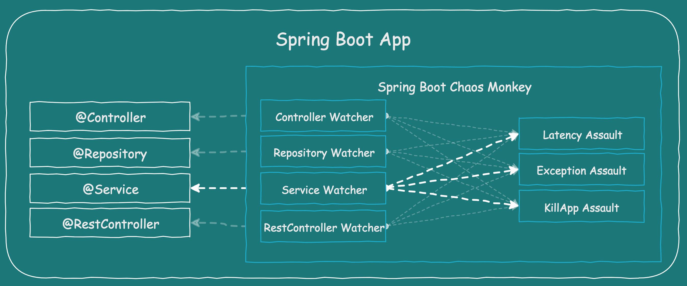

# Chaos Monkey for Spring Boot
### inspired by Chaos Engineering at Netflix

  

This project provides a Chaos Monkey for Spring Boot and will try to attack your running [Spring Boot](https://projects.spring.io/spring-boot/) App.

>Chaos Engineering is the discipline of experimenting on a distributed system
in order to build confidence in the system’s capability
to withstand turbulent conditions in production.
> *principlesofchaos.org*

## Content
- [Goal of Chaos Monkey](#goal)
- [Social and communicative](#social)
- [What does Chaos Monkey for Spring Boot do?](#dochaos)
- [How does it work?](#howitworks)
  - [Watcher](#watcher)
  - [Assault](#assaults)
  - [Properties & Configuration](#config)

## What is the goal of Chaos Monkey?
Inspired by [PRINCIPLES OF CHAOS ENGINEERING](http://principlesofchaos.org/) and by my work in distributed system, with a focus on Spring Boot, I wanted to test the resulting applications better and especially during operation.

After writing many unit and integration tests, a code coverage from 70% to 80%, this unpleasant feeling remains, how our baby behaves in production?  
Many questions remain unanswered:
- Will our fallbacks work?
- How does the application behave with network latency?
- What if one of our services breaks down?
- Service Discovery works, but is our Client-Side-Load-Balancing also working?

As you can see, there are many more questions and open topics you have to deal with.

That was my start to take a deep dive into Chaos Engineering and I started this little project to share my thoughts and experience.

## Be social and communicative!
If you start to implement Chaos Engineering at your company, then you must be a very social and communicative person. Why, because you will get to know many of your colleagues personally in a very short time when your chaos experiments strike.

### Check your resilience
Are your services already resilient and can handle failures? Don´t start a chaos experiment if not!
### Implement active application monitoring
Check your monitoring and check if you can see the overall state of your system. There are many great tools out there to get a pleasant feeling about your entire system.
### Define steady states
Define a metric to check a steady state about your service and of course your entire system. Start small with a service that is not so critical.
### Do not start in production
Of course, you can start in production, but keep in mind...

> The best place on earth is...production! 
> *Josh Long*

...so let's keep production as the best place on earth and look for our first experiences on another stage. If all goes well and your company is further on to you, run it in production.

## What does the Chaos Monkey for Spring Boot do?
Spring Boot Chaos Monkey is a small library which you can integrate as a dependency into your existing application. As long as you don't set the application property "<b>chaos.monkey.enabled</b>" to "<b>true</b>", nothing will happen.

As you can see, you don't have to change the source code!

### How does it work?
If Spring Boot Chaos Monkey is on your classpath with the property "chaos.monkey.enabled=true", it will automatically scan your application for all classes annotated with any of the following Spring annotations:

- @Controller
- @RestController
- @Service
- @Repository

By configuration you define which assaults and watcher are activated, per default only the @Service watcher and the latency assault are activated.

  

#### Example - single Spring Boot application
Let's say you built a standalone Spring Boot application. For example, there is a service annotated with Spring @Service annotation and some other components. Now we want to attack our service component.

  

Let´s activate Chaos Monkey for Spring Boot, only 2 steps are required.

1. Added Chaos Monkey for Spring Boot to your dependencies.

<dependency>
    <groupId>de.codecentric</groupId>
    <artifactId>chaos-monkey-spring-boot</artifactId>
    <version>1.0.1</version>
</dependency>

2. Start your app enabling the service using the property below:

java -jar your-app.jar --chaos.monkey.enabled=true


Chaos Monkey for Spring Boot will attack your @Service classes and will randomly add some latency to all <b>public</b> methods.

There are some more assaults and watcher, that can attack your app.

## Watcher
A watcher is a Chaos Monkey for Spring Boot component, that will scan your app for a specific type of annotation.

Following Spring annotation are supported:
- @Controller
- @RestController
- @Service
- @Repository

With the help of [Spring AOP](https://docs.spring.io/spring/docs/current/spring-framework-reference/core.html), Chaos Monkey recognizes the execution of a public method and will either not execute any action or start one of its assaults. You can customize the behave by configuration.

## Assaults

Following assaults are actual provided:
- Latency Assault
- Exception Assault
- AppKiller Assault

You can customize the behave by configuration.

## Properties & Configuration

| Property        | Description                | Values  | Default |
| ------------- |------------------| -----:|----:|
| chaos.monkey.enabled | Enable or disable the Chaos Monkey service | TRUE or FALSE	 | FALSE
| chaos.monkey.assaults.level | How many requests are to be attacked.  1 each request, 5 each 5th request is attacked | 1-10 | 5
|chaos.monkey.assaults.latencyRangeStart | Minimum latency in ms added to the request| Integer.MIN_VALUE, Integer.MAX_VALUE  | 3000
|chaos.monkey.assaults.latencyRangeEnd | Maximum latency in ms added to the request| Integer.MIN_VALUE, Integer.MAX_VALUE  | 15000
|chaos.monkey.assaults.latencyActive | Latency assault active| TRUE or FALSE | TRUE
|chaos.monkey.assaults.exceptionsActive | Exception assault active| TRUE or FALSE | FALSE
|chaos.monkey.assaults.killApplicationActive | AppKiller assault active| TRUE or FALSE | FALSE
chaos.monkey.watcher.controller | Controller watcher active| TRUE or FALSE | FALSE
chaos.monkey.watcher.restController | RestController watcher active| TRUE or FALSE | FALSE
chaos.monkey.watcher.service | Service watcher active| TRUE or FALSE | TRUE
chaos.monkey.watcher.repository | Repository watcher active| TRUE or FALSE | FALSE
chaos.monkey.watcher.component | Component watcher active| TRUE or FALSE | FALSE

> I´m still working on this page and the documentation!
